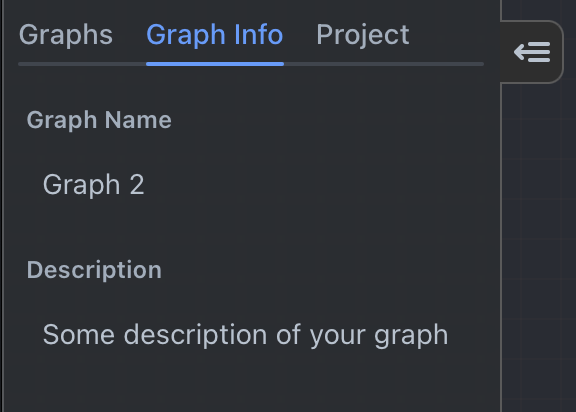
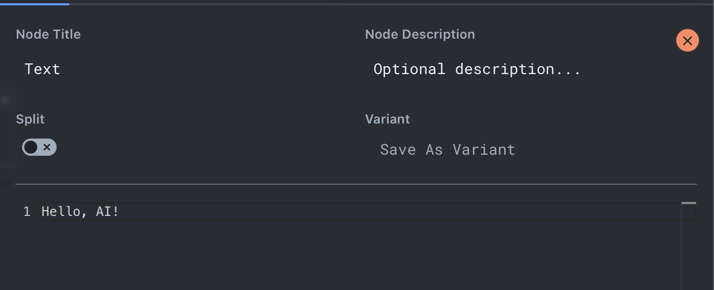

## Sidebar

### Project Info Tab

In the project info tab you can set the name and description of your project. This data is saved with your project file and used for documenting your project.

On the project info tab you can also configure what plugins are enabled for your project. See the [Plugins](./plugins.md) documentation for more information.

### Graphs Tab

The graphs tab is where you can navigate between all graphs in your project, add new graphs, and delete/duplicate existing graphs.

Clicking on a graph in the list will open it in the main graph area. To add a new graph, right click in the blank space in the graph list and select "New Graph".

To delete a graph, right click on it and select "Delete Graph". This will delete the graph from your project.

:::caution

There is no undo at this time! Deleting a graph is permanent! We recommend you store your rivet project files in source control.

:::

To duplicate a graph, right click on it and select "Duplicate Graph". This will create a new graph with the same nodes and connections as the original graph.

### Graph Info Tab

In the graph info tab you can set the name and description of your graph. This data is saved with your project file and used for documenting your graph and organizing your graphs in the graph list.

## Graph

You will mainly be working in the Graph area of the interface. It contains all of your nodes in the current graph and the connections between them.

### Nodes

For information on how to manipulate nodes, see [Working with Nodes](./adding-connecting-nodes.md).

### Canvas

The canvas is the main area of the graph. You can click and drag on the canvas to move the graph around. You can also use the scroll wheel to zoom in and out.

Right click to open the context menu to add new nodes.

Hold shift and drag to create a selection box. Any nodes inside the selection box will be selected. You can then move all of the selected nodes as a group, or create a subgraph from the selected nodes. You can also hold shift and click the title bar of a node to add it to the selection.

## Node Editor

The node editor is visible when you click the edit node icon on a node. It is used to edit the data on the node.

You can close the node editor by clicking the close button in the top right, by pressing the escape key, or by clicking on any blank space in the graph.

### Node Title & Description

You can edit the title of the node in the node editor (changes the title shown on the graph). You can also edit the description of the node in the node editor, for documentation purposes.

### Split Node

Toggles whether the node is a split node. For more information on split nodes, see the [Splitting](./splitting) documentation.

When splitting is enabled, the number input next to the split toggle is the **maximum split amount**. This is a safeguard for excessive splitting. If the data exceeds the maximum split amount, only the first N items will be executed, where N is the maximum split amount.

### Variants

Variants are used to create multiple versions of the same node. The button on the right allows you to save the current node configuration as a new variant. The dropdown on the left allows you to apply existing variants to the current data on the node.

Variants allow you to save slight differences to a node, and test them without losing the data. For example, you may have a [Text Node](../node-reference/text) with a message to an LLM. You may want to test different variations of the message to see which one performs better and gives better AI results.

### Node Data Editor

This area contains the editors for the currently selected node. The editor will change depending on the type of node you are editing. For example, the shown [Text Node](../node-reference/text) has a text editor, and the [Chat Node](../node-reference/chat) has a chat configuration editor.

## Overlays

At the top of the screen are a set of overlay panels you may enable. The available overlays are listed below.

### Prompt Designer

The prompt designer allows you to tweak an individual prompt to get the output you are looking for. See the [Prompt Designer](./prompt-designer.md) documentation for more information.

### Trivet Tests

Trivet allows you to set up test suites and test cases for your project. See the [Trivet](../trivet.md) documentation for more information.

### Chat Viewer

The chat viewer overlay gives you a gives you a full screen view of every Chat node that has been performed, or is in-progress, in your project.

This view can give you a quick overview of how your AI is performing, and what it is doing at any given time. It can also be used to debug issues with your AI.

## Action Bar

The action bar is in the top-right of the screen. It contains buttons for running, pausing, and aborting the current graph, and the main Rivet menu button.

### Run

Clicking the run button will run the current graph.

### Abort

Visible while a graph is running. Clicking the abort button will abort the current graph.

### Pause/Resume

Visible while a graph is running. Clicking the pause button will pause the current graph, and clicking the resume button will resume the current graph from where it was paused.

### Menu

Access the main Rivet menu by clicking the menu '...' button.
